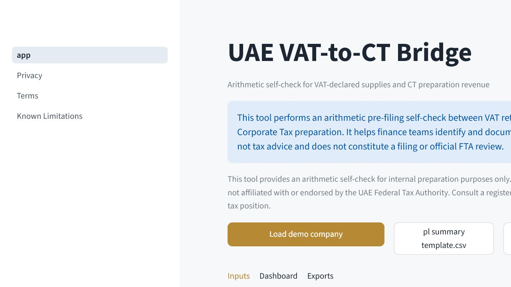
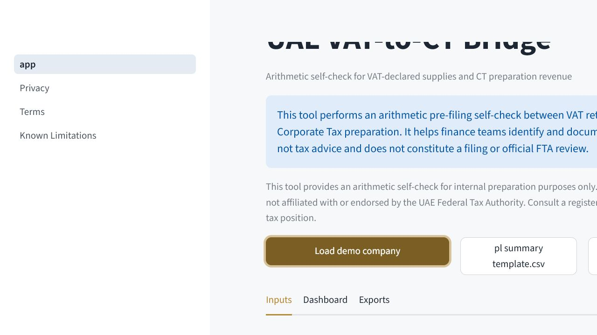
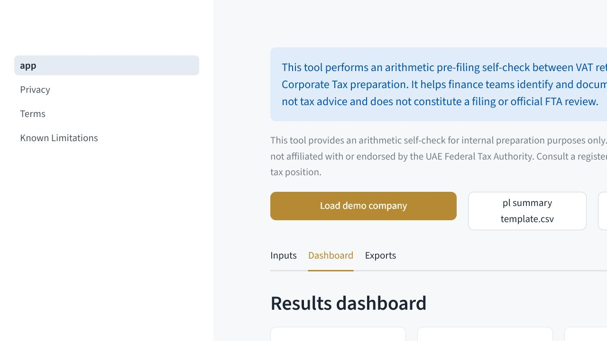
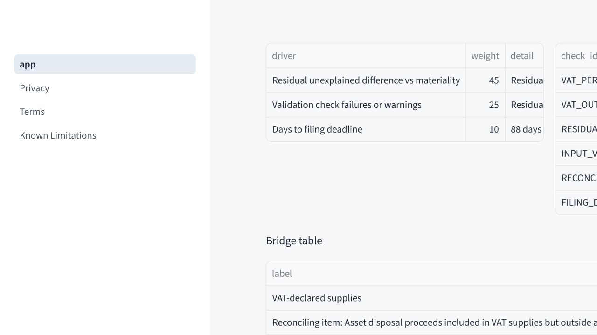
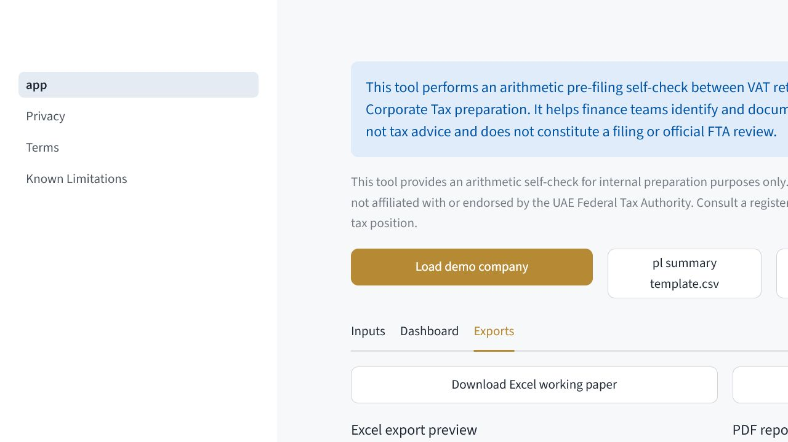
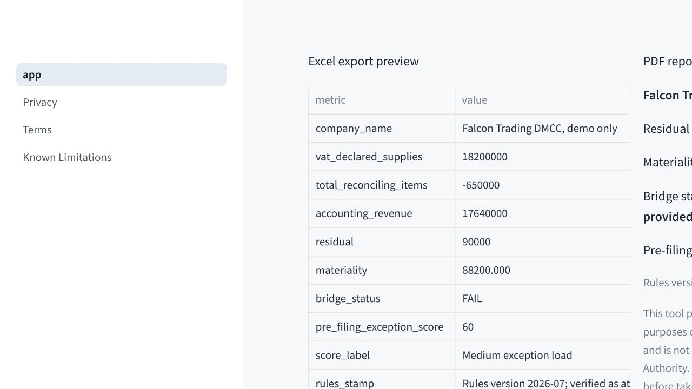

# UAE VAT-to-CT Bridge

UAE VAT-to-CT Bridge is a Streamlit-based arithmetic self-check that reconciles VAT-declared supplies to accounting revenue used in Corporate Tax preparation. It is designed as an internal finance working paper tool and portfolio demo. It is not a filing tool, tax advice, or an official FTA product.

## What It Does

- Loads VAT return totals and a simple P&L summary from CSV or XLSX files.
- Captures CT computation figures through a manual form.
- Applies signed reconciling items to create a VAT-to-CT revenue bridge.
- Shows residual unexplained difference, materiality, checks, and a pre-filing exception score.
- Exports an Excel working paper and a PDF bridge report.

## UAE Pre-Filing Reconciliation Problem

Finance teams preparing UAE Corporate Tax often need to explain why VAT-declared supplies do or do not tie to accounting revenue used in CT preparation. Timing differences, asset disposals, reverse-charge context, credit notes, and other reconciling items can create a gap. This tool turns that gap into a documented arithmetic bridge before filing work is finalised.

## What It Does Not Do

- It does not calculate CT liability.
- It does not prepare or submit VAT or CT filings.
- It does not predict FTA audit risk.
- It does not replicate EmaraTax or FTA systems.
- It does not provide tax advice or confirm VAT/CT treatment.

## Screenshots

Release screenshots belong under `docs/screenshots/` and must use only the synthetic demo dataset. The screenshot checklist is committed in `docs/screenshots/README.md`; the first `v0.1.0` tag should wait until those images are captured from the local or deployed app.













## Demo Dataset

The committed demo dataset uses synthetic data for `Falcon Trading DMCC, demo only`. It has quarterly FY2025 VAT periods, VAT-declared supplies of approximately AED 18.2 million, RCM context of AED 1.2 million, documented reconciling items of AED 650,000, and a deliberate AED 90,000 residual unexplained difference.

## Local Setup

```bash
python -m venv .venv
.venv\Scripts\activate
pip install -e ".[dev]"
```

## Run The App

```bash
streamlit run app.py
```

or:

```bash
python -m streamlit run app.py --server.port 8501 --server.headless true
```

## Test Commands

```bash
ruff check --no-cache .
ruff format --no-cache .
pytest
pytest --cov=engine --cov-report=term-missing
python -m engine.demo_run
```

## Data Privacy

The app processes uploaded files in memory during the Streamlit session. It does not intentionally store uploaded files, parsed user data, analytics payloads, or generated user reports in the repository. Generated Excel and PDF exports are assembled in memory for the active download flow. Demo data is synthetic.

## Security Hygiene

- Uploads are limited to `.csv` and `.xlsx`.
- `.xlsm` files are rejected.
- Uploaded files are limited to 10 MB.
- XLSX files are read with `openpyxl` in read-only and data-only mode.
- Spreadsheet formulas and macros are not executed.
- User-facing errors are generic and avoid raw stack traces.

## CI

GitHub Actions runs on push and pull request:

```bash
ruff check --no-cache .
ruff format --check --no-cache .
pytest --cov=engine --cov-report=term-missing
python -m engine.demo_run
```

Coverage is configured to fail below 80 percent for the `engine/` package.

## Tax Advice Disclaimer

This tool provides an arithmetic self-check for internal preparation purposes only. It is not tax advice, does not constitute a tax filing, and is not affiliated with or endorsed by the UAE Federal Tax Authority. Consult a registered UAE tax agent or qualified adviser before taking any tax position.

## Known Limitations

- MVP uses a simple P&L summary, not a full trial balance.
- Reconciling items are manually entered or uploaded.
- QFZP, Small Business Relief, WPS, related-party, transfer-pricing, and Odoo checks are out of scope.
- Rules are stamped as verified on 2026-07-04 and should be refreshed before reliance.

## Roadmap

- Full trial balance upload.
- Account mapping UI.
- Mapping save/load JSON.
- Session reload JSON.
- Carefully worded QFZP advisory note.
- Small Business Relief consistency note.
- Related-party transaction schedule upload.
- WPS payroll/headcount context check.
- Better PDF styling.
- Odoo export template compatibility.

## Release Checklist

Do not tag `v0.1.0` until CI is green, engine coverage is at least 80 percent, the demo smoke test and golden-file test pass, README and screenshots are complete, Excel and PDF exports work, the Streamlit app runs locally, the deployed app uses synthetic demo data, disclaimers are visible, and no uploaded data is written to disk except active-session export generation.

## Licence

MIT. See `LICENSE`.
