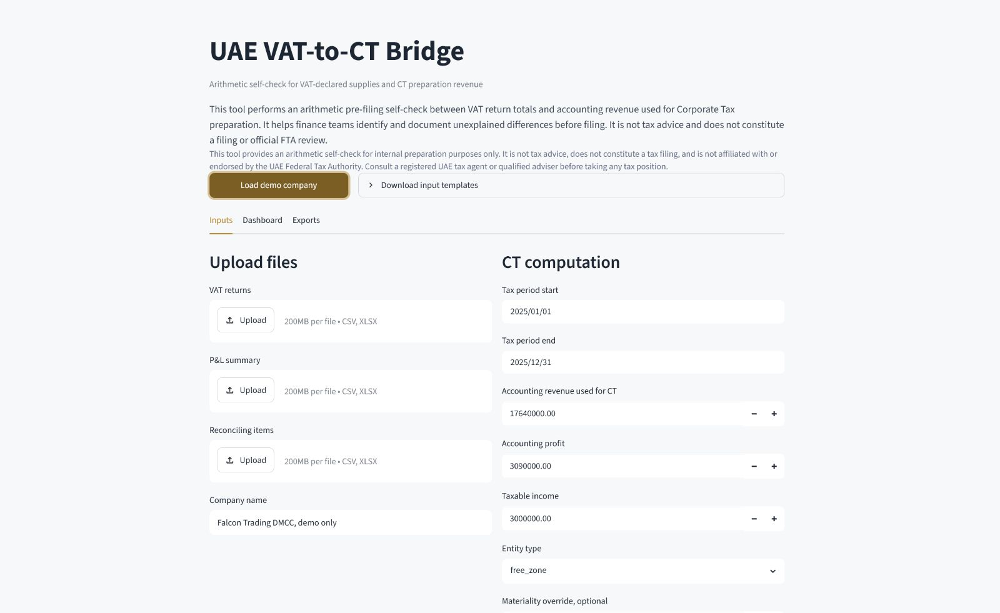
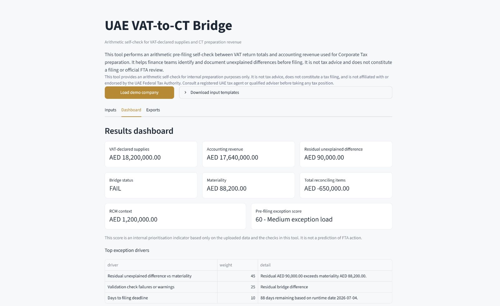
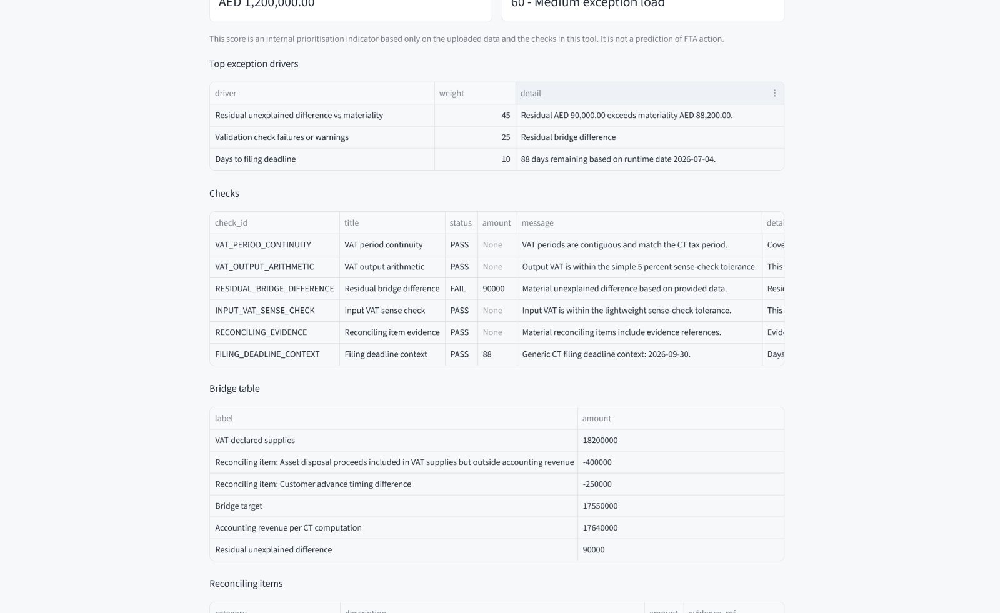
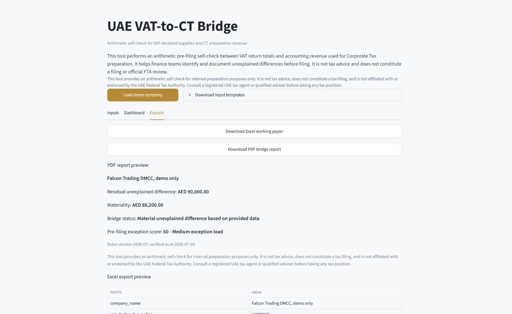

# UAE VAT-to-CT Bridge

UAE VAT-to-CT Bridge is a Streamlit-based arithmetic self-check that reconciles VAT-declared supplies to accounting revenue used in UAE Corporate Tax preparation. It is designed as an internal finance working paper and portfolio demo, not as a filing product, tax advice tool, or official UAE Federal Tax Authority service.

## Why It Exists

Finance teams preparing UAE Corporate Tax often need to explain why VAT-declared supplies do or do not tie to accounting revenue. Timing differences, asset disposals, credit notes, reverse-charge context, and other reconciling items can create a gap. This tool turns that gap into a documented pre-filing bridge so finance teams can identify unexplained differences before finalising filing work.

## What It Does

- Loads VAT return totals and a simple P&L summary from CSV or XLSX files.
- Captures CT computation figures through a manual form.
- Applies signed reconciling items to create a VAT-to-CT revenue bridge.
- Shows residual unexplained difference, materiality, checks, and a pre-filing exception score.
- Exports an Excel working paper and a PDF bridge report.

## What It Does Not Do

- It does not calculate CT liability.
- It does not prepare or submit VAT or CT filings.
- It does not predict FTA action.
- It does not replicate EmaraTax or FTA systems.
- It does not provide tax advice or confirm VAT/CT treatment.

## Screenshots










## Demo Dataset

The committed demo dataset uses synthetic data for `Falcon Trading DMCC, demo only`. It includes quarterly FY2025 VAT periods, VAT-declared supplies of approximately AED 18.2 million, RCM context of AED 1.2 million, documented reconciling items of AED 650,000, and a deliberate AED 90,000 residual unexplained difference.

## Local Setup

```powershell
python -m venv .venv
.\.venv\Scripts\activate
python -m pip install -e ".[dev]"
```

## Run The App

```powershell
python -m streamlit run app.py
```

or, for a fixed local port:

```powershell
python -m streamlit run app.py --server.port 8501 --server.headless true
```

## Validation Commands

```powershell
python -m ruff check --no-cache .
python -m ruff format --check --no-cache .
python -m pytest
python -m pytest --cov=engine --cov-report=term-missing
python -m engine.demo_run
```

## Privacy And Data Handling

The app processes uploaded files in memory during the Streamlit session. It does not intentionally store uploaded files, parsed user data, analytics payloads, or generated user reports in the repository. Generated Excel and PDF exports are assembled in memory for the active download flow. Demo data is synthetic.

## Security Notes

- Uploads are limited to `.csv` and `.xlsx`.
- `.xlsm` files are rejected.
- Uploaded files are limited to 10 MB.
- XLSX files are read with `openpyxl` in read-only and data-only mode.
- Spreadsheet formulas and macros are not executed.
- User-facing errors are generic and avoid raw stack traces.

## CI

GitHub Actions runs linting, formatting checks, engine tests with coverage, and the headless demo smoke test on push and pull request. Engine coverage is configured to fail below 80 percent.

## Project Status

MVP polish is in progress. The engine vertical slice, demo dataset, exports, UI, CI workflow, and screenshots are present. Release tagging is intentionally held until the public README and screenshots have been reviewed in GitHub.

## Tax Advice Disclaimer

This tool provides an arithmetic self-check for internal preparation purposes only. It is not tax advice, does not constitute a tax filing, and is not affiliated with or endorsed by the UAE Federal Tax Authority. Consult a registered UAE tax agent or qualified adviser before taking any tax position.

## Known Limitations

- MVP uses a simple P&L summary, not a full trial balance.
- Reconciling items are manually entered or uploaded.
- QFZP, Small Business Relief, related-party, transfer-pricing, and Odoo checks are out of scope.
- Rules are stamped as verified on 2026-07-04 and should be refreshed before reliance.

## Roadmap

- Full trial balance upload.
- Account mapping UI.
- Mapping save/load JSON.
- Session reload JSON.
- Carefully worded QFZP advisory note.
- Small Business Relief consistency note.
- Related-party transaction schedule upload.
- Better PDF styling.
- Odoo export template compatibility.

## Licence

MIT. See `LICENSE`.
